### What's your operating system?

Determine if your Windows is a 32 or 64-bit operating system
- Settings > System > About
- Jot down the information for "System type" for your operating system.
- You'll need this information to know which installers you should download

This is an example of my windows laptop settings:

```
Device name	DESKTOP-AMF1AI7
Processor	Intel(R) Core(TM) i7-10750H CPU @ 2.60GHz   2.59 GHz
Installed RAM	16.0 GB (15.8 GB usable)
Device ID	266B527B-4A56-40F3-9744-CC590AFFB317
Product ID	00325-81846-23593-AAOEM
System type	64-bit operating system, x64-based processor
Pen and touch	No pen or touch input is available for this display
```

### Download Git

Git is a tool that is used to manage code for your projects.

Locate the download for your operating system and system type (e.g., 32, 64) and download the Git installer.
- https://git-scm.com/download/win

Run the downloaded installer; accept all defaults when prompted.

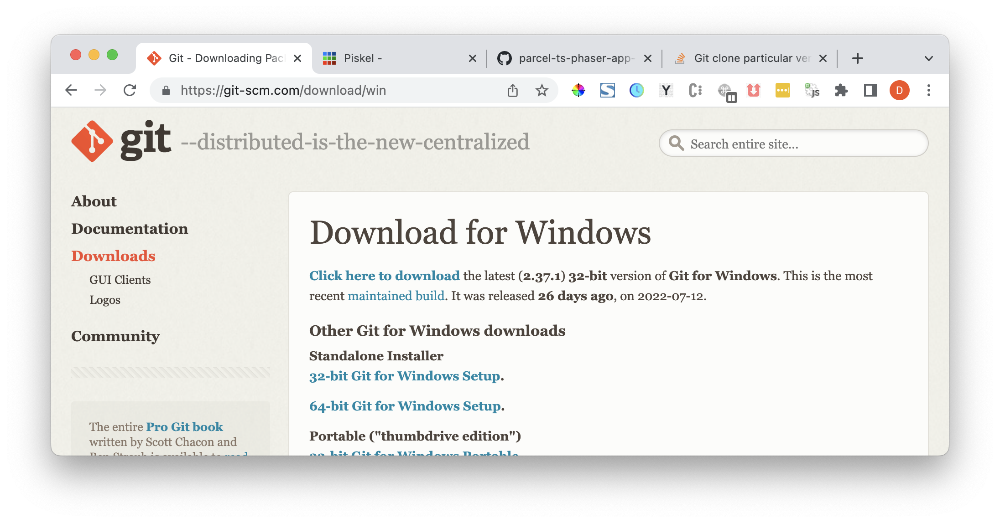

This should also install an application called "Git Bash".  You will use this shell for much of the development activities in our class.  When you use this application, make sure to "Run as administrator".

### Download NVM and install `nvm` and Node.js

The programming language we will be using for this class will be Node.js.  Use the first link below to locate the download for your operating system and system type.  You may use the second link to help guide you through the process of installing `nvm`.  Install `nvm` and accept all defaults when prompted.

Download `nvm`
- https://github.com/coreybutler/nvm-windows/releases
- https://dev.to/skaytech/how-to-install-node-version-manager-nvm-for-windows-10-4nbi

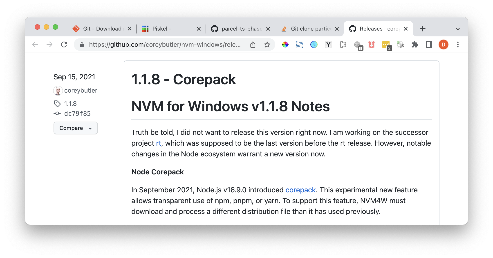

Drag install application (nvm-setup) to your desktop, right click and "Run as administrator".  Open "Git Bash" using the "Run as administrator" option.  Install Node.js by executing each command in Git Bash.

Use nvm to install Node.js
```
nvm install 16.16.0
nvm use 16.16.0
```

### Install Visual Studio Code

Some of you may be new to Node.js and the Phaser.io libraries.  An Integrated Development Environment (IDE) should help in suggesting the code you will enter and in providing some documentation on how the Phaser.io library works.

Locate the download for your operating system and system type (e.g., 32, 64) and download the Visual Studio Code installer.

Download Visual Studio Code
- https://code.visualstudio.com/Download

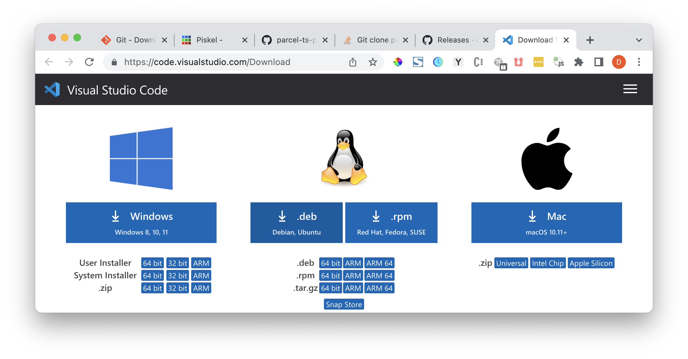

The Visual Studio Code application supports different features that may be included in extensions.  You may have heard of or even used Chrome extensions.  It's the same idea only these extensions should help us to more easily write and format the code we will be writing.  Click on each link and follow the instructions to install the extensions in your copy of Visual Studio Code.

When Visual Studio Code opens the extension, click the green install button to install the extension.  You should go through this step for all three extensions.

Install Visual Studio Code Extensions
- ESLint: https://marketplace.visualstudio.com/items?itemName=dbaeumer.vscode-eslint
- IntelliCode: https://marketplace.visualstudio.com/items?itemName=VisualStudioExptTeam.vscodeintellicode
- Prettier - Code formatter: https://marketplace.visualstudio.com/items?itemName=esbenp.prettier-vscode

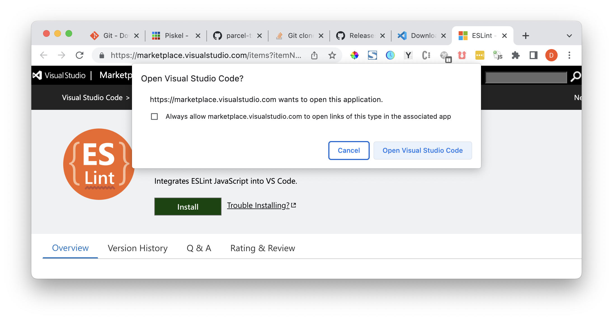

When Visual Studio Code opens the extension, click the blue install button.

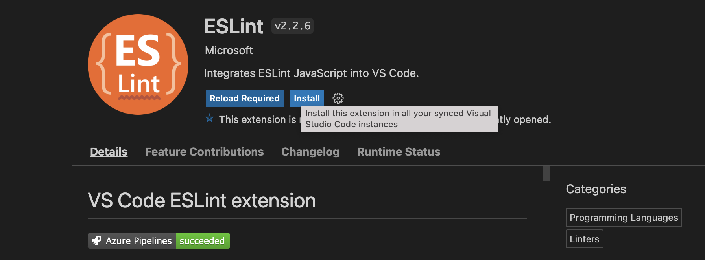

Local Prettier extensions
- click on extensions icon on the left side bar
- click on the Prettier extension; the right pane should open more information about Prettier

Find Prettier in list of extensions
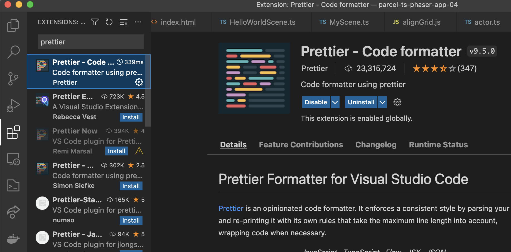

Gear/Cog
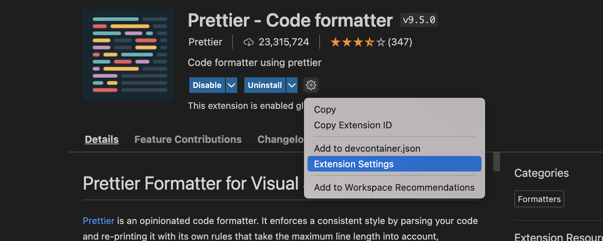

Please configure the Prettier extension as follows
- Click the gear/cog next to the extension name
- Update Config Path to point to ".prettierrc"
- Right click and format document; select Prettier as the function to format

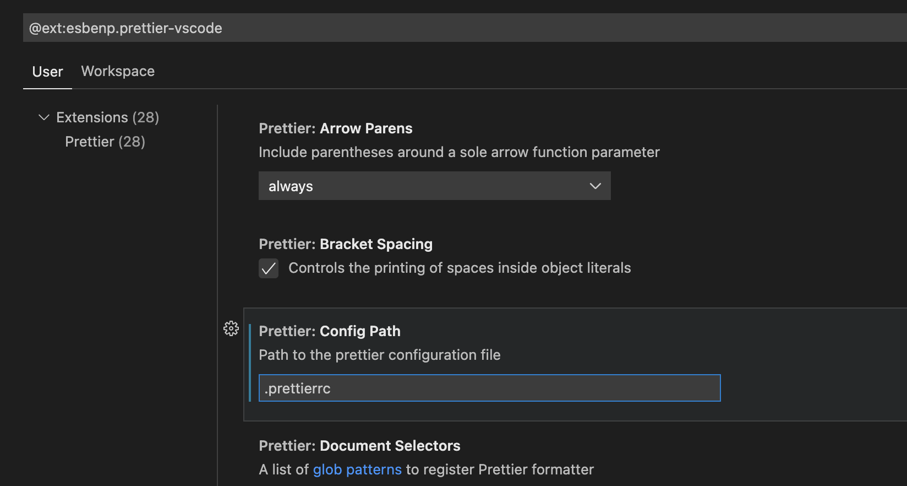


Restart "Git Bash"
- Once Visual Studio Code has been installed, please close all "Git Bash" windows and restart "Git Bash" ("Run as administrator").  
- This should allow the "code" command to work in "Git Bash" later on.

### Install Tiled
- https://thorbjorn.itch.io/tiled

At some point, we will be using a tool to help us create the levels in your game.
- Click Download Now
- You are not required to pay anything! Click "No thanks, just take me to the downloads"
- Click the Download button for your appropriate operating system

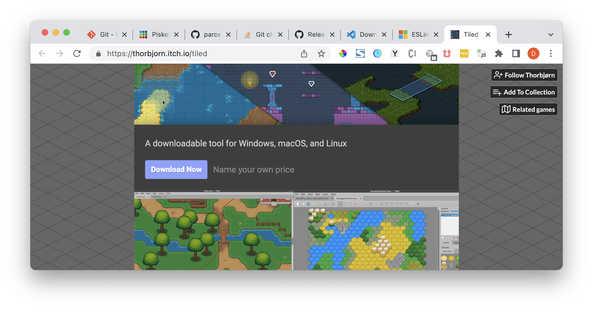

### Bookmark Piskel.com
- https://www.piskelapp.com/p/create/sprite

What would a game be without graphics?!  You will be able to create your own custom characters, complete with animations using the free Pisckel.com application.  It runs in your browser.

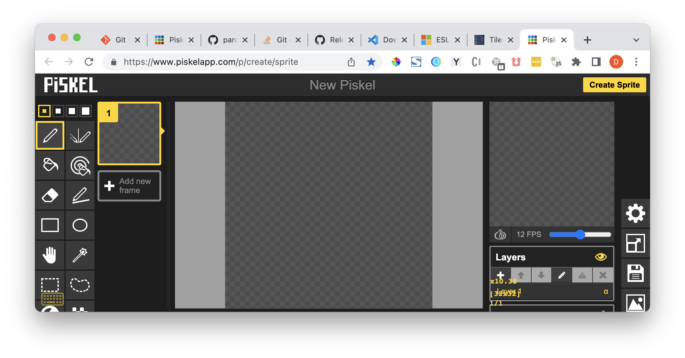

### Install typescript

Typescript is a form of Node.js.  This is kind of like two individuals who technically speak the same language, but each has their own dialect.  Why will we be using Typescript?  Part of the reason is to help you write code and understand the code better thanks to the use of typing.  We'll get into that later.  For now, open "Get Bash" (remember, using "Run as administrator") and run the following command.

Note: this may take a few seconds to run, so be patient ;)

```
npm install --location=global typescript ts-node
```

### Start your project

Decide a directory where you plan on storing your game files.  E.g., if my "home" directory were "C:/Users/dcvez" (or "/c/Users/dcvez" while in "Git Bash"), then create a "phaser" folder.

To move to your home directory, type
```
cd ~
```

Once it's created, move to your game project directory, type
```
cd ~/phaser/dungeon-game
```

To view the contents of the directory you are currently in
```
ls
```

To view the full path of the directory you are currently in
```
pwd
```

Create a directory for your new games and navigate (cd; set "current directory")
```
cd ~
mkdir phaser
cd phaser
```

Once you have navigated to the "phaser" directory, use `git` to get a copy of (or "clone") the project starter code.  Make sure to substitute your initials for "<initials>".


Install more node libraries
```
npm install --location=global parcel
```

Clone repo, navigate to the game project directory created and set up the project starter code files.
```
git clone https://github.com/dcvezzani/parcel-ts-phaser-app-04.git dungeon-game
cd dungeon-game
git checkout 1.0.1
```

You should see some message about being in an "detached state".  Do not worry; this is fine.  Now you will create a branch (or a space) for you to write your code.

Create your game development branch
```
git checkout -b <initials>/dev # e.g., git checkout -b dcv/dev
```

View your project in Visual Studio Code

Execute the following in "Git Bash"
```
code .
```

Now click on the files icon in the left pane (typically the top icon) to view the project starter files.

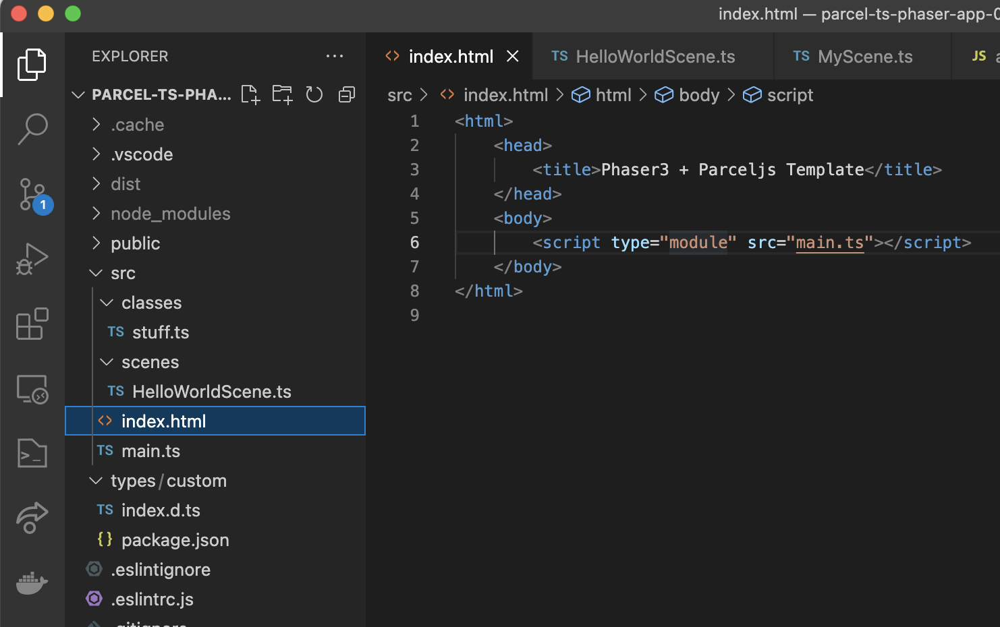

You should now see some code in the left pane of the Visual Studio Code IDE.  You should now be ready for our class.  That being said, wouldn't it be nice to see something for all the effort you put into getting through all these setup steps?!

From "Git Bash", execute the following:

You may be prompted to allow running your game through your firewall.  If so, it should be safe to click "Allow".

```
npm install
npm run start
```

Then open a web browser window and navigate to:
- http://localhost:8000

Great job!!

If you were able to execute those last two "Git Bash" shell commands without errors and you see something in your browser window (you'll know what I mean), then you should be all set to start our next class!


